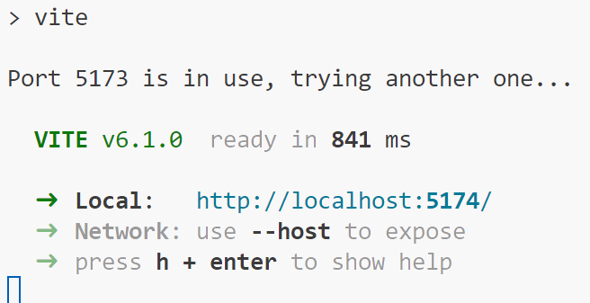
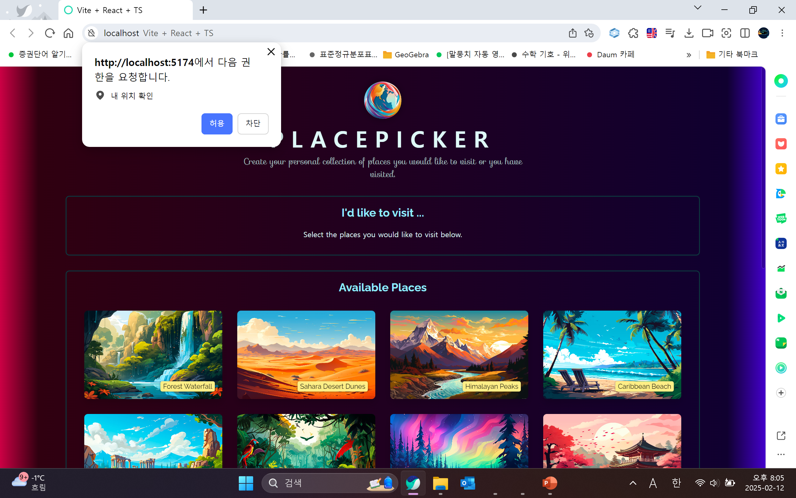

# react-project-5-3

This is a demo project for react on picking the place you wish to visit.

A demo project for react;

1. useEffect and useCallBack Hooks (Udemy Lecture 11)
2. Working with backend (Lecture 15)
3. Using Custom Hooks (Lecture 16)

## Branch Descriptions

- `tsify`: The transformed code of the initial lecture project (in Vite+React+TS)
- `tsify-after11`: The code from `tsify` after following through lecture 11.

The `main` branch currently (on 25/02/12) only has the licence.

## Program Execution

### Installation

Download this branch content.

Then, run

```bash
npm install
npm run dev
```

And visit the resulting website from the console.



e.g. http://localhost:5174/

Then you would see website like this:



### Key Features

#### Feature 1: Place Picking Logic

##### 1.1. Function

You can select the places from the `Available Places` list to add to your visiting list.

##### 1.2. Usage

###### 1.2.1. Input

Select the place you wish to visit by clicking them.

###### 1.2.2. Output

If the place is not already added to your list, then the place is added to your visiting list.

The visiting list shows the picked places in the order you picked them.

<video controls src="resources/Feature1.mp4" title="Feature 1 Demonstration"></video>

##### 1.3. Use Cases

You can view each of the available places, pick the ones you wish to visit, and seeking through all available places, you can view only the list of places you wish to visit.

This could filter out candidate places you wish to visit, or make a bucket list of your trips.

#### Feature 2: Available Place Sorting via physical location.

##### 2.1. Function

When you give the browser the access to your current physical location, the available place list gets sorted by distance.

##### 2.2. Usage

###### 2.2.1. Input

Give the access to your current physical location to the website.

###### 2.2.2. Output

The available places get sorted via the physical location.

<video controls src="resources/Feature2.mp4" title="Feature 2 Demonstration"></video>

##### 2.3. Use Cases

You can view the places from the first of the list to view a more closer place so that you can consider the distance of the place from your location.

#### Feature 3: Auto-removal from the favorite list

##### 3.1. Function

Given a click on the place from your favorite list, you can delete the place from your list.

In fact, it gets deleted 3 seconds after you press it.

##### 3.2. Usage

###### 3.2.1. Input

Click the place in your list that you wish to exclude from your list.

###### 3.2.2. Output

The place is excluded from your favorite list.

<video controls src="resources/Feature3.mp4" title="Feature 3 Demonstration"></video>

##### 3.3. Use Cases

~~It's fancy, right?~~

## Getting Started

These instructions will get you a copy of the project up and running on your local machine for development and testing purposes. See deployment for notes on how to deploy the project on a live system.

### Prerequisites

What things you need to install the software and how to install them

- [node.js](https://nodejs.org/)
- [git](https://git-scm.com) (or you can just download the programs manually from the repository website)

<!-- ```
Give examples
``` -->

### Installing

A step by step series of examples that tell you how to get a development env running

#### 1. Download Program Files

#### 2. Run the following code (once)

```bash
npm install
```

#### 3. Run the development env

```bash
npm run dev
```

<!-- End with an example of getting some data out of the system or using it for a little demo -->

<!-- ## Running the tests

Explain how to run the automated tests for this system

### Break down into end to end tests

Explain what these tests test and why

```
Give an example
```

### And coding style tests

Explain what these tests test and why

```
Give an example
``` -->

<!-- ## Deployment

Add additional notes about how to deploy this on a live system -->

## Built With

<!-- * [Dropwizard](http://www.dropwizard.io/1.0.2/docs/) - The web framework used -->

- [node.js](https://nodejs.org/) - Dependency Management
<!-- * [ROME](https://rometools.github.io/rome/) - Used to generate RSS Feeds -->

<!-- ## Contributing

Please read [CONTRIBUTING.md](https://gist.github.com/PurpleBooth/b24679402957c63ec426) for details on our code of conduct, and the process for submitting pull requests to us. -->

<!-- ## Versioning

We use [SemVer](http://semver.org/) for versioning. For the versions available, see the [tags on this repository](https://github.com/your/project/tags).  -->

## Authors

- **Jaehyun Bhang** - _Initial work_ - [calculus0129](https://github.com/calculus0129)

See also the list of [contributors](https://github.com/calculus0129/react-project-5-3/contributors) who participated in this project.

## License

This project is licensed under the MIT License - see the [LICENSE](LICENSE) file for details

## Acknowledgments

- Awesome README.md format: https://gist.github.com/PurpleBooth/109311bb0361f32d87a2

<!-- Below are some advices from the default project setup:

This template provides a minimal setup to get React working in Vite with HMR and some ESLint rules.

Currently, two official plugins are available:

- [@vitejs/plugin-react](https://github.com/vitejs/vite-plugin-react/blob/main/packages/plugin-react/README.md) uses [Babel](https://babeljs.io/) for Fast Refresh
- [@vitejs/plugin-react-swc](https://github.com/vitejs/vite-plugin-react-swc) uses [SWC](https://swc.rs/) for Fast Refresh

## Expanding the ESLint configuration

If you are developing a production application, we recommend updating the configuration to enable type aware lint rules:

- Configure the top-level `parserOptions` property like this:

```js
export default tseslint.config({
  languageOptions: {
    // other options...
    parserOptions: {
      project: ['./tsconfig.node.json', './tsconfig.app.json'],
      tsconfigRootDir: import.meta.dirname,
    },
  },
})
```

- Replace `tseslint.configs.recommended` to `tseslint.configs.recommendedTypeChecked` or `tseslint.configs.strictTypeChecked`
- Optionally add `...tseslint.configs.stylisticTypeChecked`
- Install [eslint-plugin-react](https://github.com/jsx-eslint/eslint-plugin-react) and update the config:

```js
// eslint.config.js
import react from 'eslint-plugin-react'

export default tseslint.config({
  // Set the react version
  settings: { react: { version: '18.3' } },
  plugins: {
    // Add the react plugin
    react,
  },
  rules: {
    // other rules...
    // Enable its recommended rules
    ...react.configs.recommended.rules,
    ...react.configs['jsx-runtime'].rules,
  },
})
``` -->
